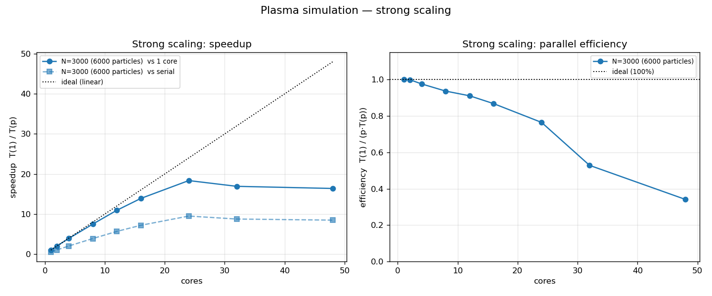
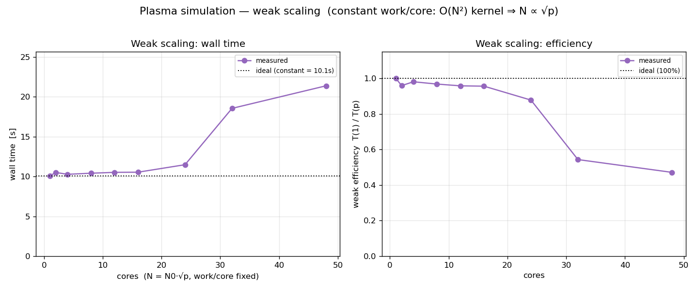

# Classical Plasma Simulation (serial + OpenMP parallel)

A classical (Newtonian / non-relativistic) molecular-dynamics style simulation
of a two-species plasma: **N electrons + N protons** confined in a rectangular
box, evolving under their mutual **Coulomb forces** and uniform **external
electric and magnetic fields**, with **elastic reflection off the walls**. The
plasma is kept hot enough that thermal motion dominates Coulomb binding, so
electrons and protons do not recombine into neutral atoms. With the default
(perpendicular) **E** and **B** the whole plasma exhibits the classic
charge-independent **E × B drift**.

The heavy compute (the simulation) is written in **C** and ships in two forms: a
**serial** version and an **OpenMP multi-core** version that share identical
physics. Both **measure and record their execution time** so the code can be
run at a range of core counts and analysed for **strong** and **weak scaling**.
The **visualisation** is a small **Python/matplotlib** script that turns the
output into an animation.

---

## Files

| File                    | Purpose                                                              |
|-------------------------|---------------------------------------------------------------------|
| `plasma_sim_serial.c`   | The serial simulator (physics + integrator + output + timing).      |
| `plasma_sim_parallel.c` | The OpenMP simulator — same physics, parallel `compute_forces`.      |
| `Makefile`              | Build either/both; helpers `run`, `run-par`, `anim`, `scaling`, `clean`. |
| `run_scaling.sh`        | Sweeps core counts for the strong- and weak-scaling studies.        |
| `plot_scaling.py`       | Turns `plasma_scaling.csv` into the scaling figures.                |
| `visualize.py`          | Reads the output and renders the animation.                         |
| `webapp/server.py`      | Browser UI backend (stdlib HTTP server + job runner). `make web`.   |
| `webapp/index.html`     | Browser UI page — parameter form, live status, animation + plots.   |
| `README.md`             | This file.                                                          |

Generated at runtime — all written into the **`output/`** directory, which is
created automatically (override with the `PLASMA_OUTDIR` environment variable).
Every name carries a **parameter suffix** (see below):

| File                       | Purpose                                                         |
|----------------------------|-----------------------------------------------------------------|
| `plasma_traj_<suffix>.bin`     | Particle positions per saved frame, raw `float32` `[frames][2N][3]`. |
| `plasma_meta_<suffix>.txt`     | Run metadata (N, box, dt, B, **E**, T, mean pressure, …) consumed by `visualize.py`. |
| `plasma_energy_<suffix>.csv`   | `step, time, KE, PE, Etot, T_kin, P, U_ext` per frame — energy check + diagnostics (`Etot` includes `U_ext`). |
| `plasma_animation_<suffix>.gif`| The animation (and `.mp4` too, if `ffmpeg` is available).       |
| `plasma_plots_<suffix>.png`    | Four-panel diagnostics figure (energy, temperature, pressure, orbits). |

Scaling study (also under `output/`, no parameter suffix — shared across runs):

| File                         | Purpose                                                       |
|------------------------------|---------------------------------------------------------------|
| `output/plasma_scaling.csv`  | Append-only timing log: one row per run (version, cores, N, times…). |
| `output/scaling_strong.png`  | Strong-scaling speedup + parallel efficiency vs core count.   |
| `output/scaling_weak.png`    | Weak-scaling wall time + efficiency vs core count.            |

### Output file naming

Each output name ends with a suffix listing the simulation parameters (just
before the extension), so runs with different settings never overwrite one
another. For N=500, Lx=1 mm, Ly=2 mm, Lz=1.5 mm, dt=10⁻¹² s, 2000 steps,
save-stride 10, T=10⁵ K, **B**=(0.5, 2, 1) T, **E**=(500, 0, 0) V/m the suffix is:

```
_N500_Lx1.0e-3_Ly2.0e-3_Lz1.5e-3_DT1.0e-12_stp2000_strd10_T1.0e5_Bx0.5_By2.0_Bz1.0_Ex500.0_Ey0.0_Ez0.0
```

`visualize.py` derives the trajectory and animation names from the meta file, so
you never type the suffix twice — run it with no argument when there is a single
run in `output/`, or pass the meta file to pick one when there are several:

```bash
python3 visualize.py output/plasma_meta_N500_..._Bz1.0.txt
```

---

## Quick start

```bash
make                    # builds BOTH ./plasma_sim_serial and ./plasma_sim_parallel
./plasma_sim_serial     # runs with the default parameters, writes the data files
python3 visualize.py    # renders plasma_animation_<suffix>.gif  (~20 s)
```

or in one go:

```bash
make anim
```

Run the parallel version on all cores (or a chosen number):

```bash
make parallel
./plasma_sim_parallel                       # uses OMP_NUM_THREADS, else all cores
OMP_NUM_THREADS=8 ./plasma_sim_parallel     # 8 threads
```

Both binaries take the same optional positional parameters; the parallel one
takes an extra `nthreads` (which overrides `OMP_NUM_THREADS`):

```bash
./plasma_sim_serial   800 3000 42        # N, nsteps, seed
./plasma_sim_parallel 800 3000 42 8      # N, nsteps, seed, nthreads
```

Every run prints its execution time and appends a timing row to
`plasma_scaling.csv` (see **Performance & scaling** below).

---

## Web UI

A small, dependency-free web app (Python standard library only) lets you set the
parameters in a browser, run the simulation, and view the resulting animation and
diagnostic plots — no editing constants, no command line.

### 1. Start the server

```bash
make web                 # builds plasma_sim_parallel if needed, serves on :8000
make web PORT=9000       # choose another port
# or directly:
python3 webapp/server.py --port 8000 [--host 0.0.0.0]
```

It prints the address it is serving on and keeps running until you stop it with
**Ctrl-C**. Leave this terminal open while you use the site.

### 2. Open the website

- **Running on your own machine:** open **`http://localhost:8000`** in a browser.
- **Running on a remote machine** (e.g. a compute node): the server listens on
  all interfaces by default, so you can browse directly to
  **`http://<host-or-ip>:8000`** (replace `<host-or-ip>` with the machine's
  hostname or address). If the port is not reachable — e.g. it is firewalled —
  tunnel it over SSH instead:

  ```bash
  ssh -L 8000:localhost:8000 <host>     # run on your laptop, keep it open
  ```

  then open **`http://localhost:8000`** on your laptop.

### 3. Run a simulation

1. **Set the parameters** in the form on the left — particles `N`, steps, seed,
   threads, box `Lx/Ly/Lz`, `dt`, temperature, softening, save-stride, and the
   full **B** and **E** vectors. Every field is pre-filled with a sensible
   default.
2. *(optional)* Click a **preset** — *E×B drift*, *Pure B gyration*, or
   *E-field acceleration* — to fill in the field values for a classic scenario,
   then tweak as you like. **Reset defaults** restores every field.
3. Click **Run simulation**. The run is queued (one simulation runs at a time)
   and the **Results** panel shows live status — *building → simulating →
   rendering → done* — with a tail of the simulator/visualizer log.
4. When it finishes, the panel displays the **animation** (`.gif`), the
   **four-panel diagnostics** figure (energy · temperature · pressure · orbits),
   and a **summary table** of the run's parameters and measured
   temperature/pressure. Use the **download** links to save the `.gif`/`.png`.
5. Change parameters and click **Run simulation** again for another run — each
   run is independent.

Behind the scenes: physics parameters reach the C binary through the `PLASMA_*`
environment variables (see below); `N/nsteps/seed/nthreads` are passed as the
usual positional arguments. Each run writes into its own
`output/web_jobs/<job-id>/` directory (via `PLASMA_OUTDIR`), so runs never
collide and the main `output/` is untouched — the newest ~20 job directories are
kept and older ones are pruned automatically. Inputs are validated/clamped
server-side and the total work per run is capped, so a stray request cannot
swamp the machine.

### Who can access the website?

**There is no login, password, or access control.** Anyone who can reach the
server's address and port can open the page and start simulations. What that
means in practice depends on how you started it:

- **`--host 0.0.0.0` (the default, used by `make web`):** the server is exposed
  on *every* network interface, so **any user or machine that can reach this
  host on the chosen port can use it** — including other users on a shared
  compute node or anyone on the same network. Each visitor can launch runs that
  consume CPU (runs are queued and capped, but still shared).
- **`--host 127.0.0.1` (localhost only):** the server is reachable **only from
  the same machine**. Remote users then reach it exclusively through their own
  SSH tunnel (`ssh -L …`), which is the safest option on a shared node:

  ```bash
  python3 webapp/server.py --host 127.0.0.1 --port 8000
  ```

- To restrict access further, pick a non-obvious port, put it behind a firewall
  / reverse proxy with authentication, or bind to localhost and share access
  only via SSH tunnels. The server runs your simulator, so treat an open port as
  giving others the ability to run jobs on this machine.

### Environment-variable parameter overrides (used by the web UI)

Both binaries now read every physics constant from an optional environment
variable, applied only when set (unset ⇒ the built-in default, so existing
command lines are unchanged). This is what lets the web UI vary parameters
without recompiling, and it is handy from the shell too:

```bash
PLASMA_TEMP=1e5 PLASMA_BZ=2 PLASMA_EX=500 PLASMA_LX=2e-3 \
  ./plasma_sim_parallel 500 2000 42 8
```

| Variable | Sets | Variable | Sets |
|----------|------|----------|------|
| `PLASMA_LX/LY/LZ` | box size (m) | `PLASMA_BX/BY/BZ` | **B** field (T) |
| `PLASMA_DT`       | time step (s) | `PLASMA_EX/EY/EZ` | **E** field (V/m) |
| `PLASMA_TEMP`     | temperature (K) | `PLASMA_SOFT` | softening ε (m) |
| `PLASMA_STRIDE`   | frame save stride | `PLASMA_OUTDIR` | output directory |

---

## Physics model

Every particle *i* carries a position **r**, velocity **v**, mass *m*
(electron or proton) and charge *q* (∓e). Each time step the total force on
each particle is

1. **Coulomb** (electrostatic) from every other particle, with a short-range
   *softening* length ε so the 1/r² force stays finite when two particles
   momentarily overlap:

   **F**ᵢ = Σⱼ≠ᵢ  k · qᵢqⱼ (**r**ᵢ − **r**ⱼ) / (|**r**ᵢ − **r**ⱼ|² + ε²)^{3/2}

   Like charges repel, unlike charges attract, and *distance/force between i and
   j is the same as between j and i*, so we compute each pair once (`j > i`) and
   apply equal-and-opposite forces (Newton's third law). This is the
   "store/compute only half of the pairwise values" optimisation.

2. **Lorentz** from the uniform external fields: **F** = q (**E** + **v** × **B**),
   i.e. a constant push q**E** (opposite on electrons and protons) plus the
   magnetic q**v**×**B** turn.

From **a** = **F**/*m* the velocity and position are advanced one step with the
**Boris pusher** — the standard, energy-conserving leap-frog scheme for charged
particles in electromagnetic fields (half electric kick — now including q**E** —
→ exact v×B rotation → half electric kick → position update). Plain explicit
Euler would artificially pump energy into the gyration; Boris does not.

The external **E** does work on the particles, so its potential energy
*U*ₑₓₜ = −Σᵢ qᵢ (**E**·**r**ᵢ) is included in the reported total energy: the
conserved quantity (and the drift check) is **KE + PE_Coulomb + U_ext**. When
**E** ⟂ **B** the guiding centres drift at **v** = (**E**×**B**)/B² —
independent of charge, mass and sign — while a component of **E** along **B**
freely accelerates the two species in opposite directions (charge separation).

After the position update each particle is **specularly reflected** off any wall
it crossed (the normal velocity component flips).

Initial state: **uniform-random positions**; **Maxwell–Boltzmann velocities**
(Gaussian per axis, width √(k_B T/m)) set by the plasma temperature, with each
species' net drift removed so the cloud stays centred.

### Default parameters ("suitable values")

| Quantity            | Symbol      | Default                | Notes                              |
|---------------------|-------------|------------------------|------------------------------------|
| Particles / species | N           | 500 (⇒ 1000 total)     | O(N²) force loop ≈ 5·10⁵ pairs/step |
| Box                 | L×W×H       | 100 × 100 × 100 µm     | `Lx, Ly, Lz`                       |
| Time step           | dt          | 1 × 10⁻¹² s (1 ps)     | ≈ 36 steps per electron gyration   |
| Steps               | T           | 2000 (⇒ 2 ns)          | `nsteps`                           |
| Temperature         | T_plasma    | 1 × 10⁵ K (≈ 8.6 eV)   | hot ⇒ stays ionised                |
| Magnetic field      | (Bx,By,Bz)  | (0, 0, 1) T            | z-aligned ⇒ visible gyration in xy |
| Electric field      | (Ex,Ey,Ez)  | (500, 0, 0) V/m        | ⟂ **B** ⇒ E×B drift ≈ 500 m/s in −y; set (0,0,0) for a pure-B run |
| Softening           | ε           | 1 × 10⁻⁶ m             | keeps Coulomb finite / no recombine|
| Frame save stride   |             | every 10 steps         | ⇒ 201 frames                       |

All are constants near the top of `plasma_sim.c` and easy to edit. With these
values the total energy is conserved to ~5·10⁻⁴ % over the whole run (see
`plasma_energy_<suffix>.csv`), and because KE ≫ |PE| the plasma is *weakly
coupled* and does not recombine — physically the intended regime.

---

## Diagnostics: temperature, pressure & plots

Alongside the animation, each run reports two derived quantities per saved frame
(written to `plasma_energy_<suffix>.csv`, and their run-means to the meta file
and the console):

- **Kinetic temperature** from equipartition, (3/2)·N_p·k_B·T = KE, i.e.
  T = 2·KE / (3·N_p·k_B). It hovers around the set temperature.
- **Pressure** from the virial expression
  P = [ 2·KE + Σ_{i<j} **r**ᵢⱼ·**F**ᵢⱼ ] / (3·V), with V = Lx·Ly·Lz. The first
  term is the ideal-gas part (P = n·k_B·T); the second is the Coulomb correction
  (repulsion raises P, attraction lowers it). The magnetic force does no work and
  is purely rotational, so it does not enter the scalar pressure. The mean
  pressure is also shown in the animation caption next to **B** and T.

`visualize.py` additionally writes a four-panel figure `plasma_plots_<suffix>.png`:

1. **Energy conservation** — KE, Coulomb PE and total energy vs time (plus the
   external-field PE *U*ₑₓₜ when a field is set; the plotted total is the
   conserved KE + PE + *U*ₑₓₜ).
2. **Kinetic temperature** vs time, with the set-point line.
3. **Pressure** vs time, with the ideal-gas line n·k_B·T for comparison.
4. **Larmor orbits** — the *xy* tracks of a few sample electrons and protons,
   showing the tight electron gyration vs the sluggish, heavy protons.

---

## Running on ANL CELS GCE

The default toolchain on the GCE compute nodes is sufficient — `gcc`, `make`,
and Python with `numpy`/`matplotlib` are available; no modules need loading.
(`ffmpeg` is not installed, so the animation is saved as a **GIF**; if you load
an `ffmpeg` module an `.mp4` is written as well.)

Recommended: do the compute-heavy run on a **compute node**, not a login node
(see the CELS docs: <https://help.cels.anl.gov/docs/linux/login-compute-and-home-nodes>).

```bash
ssh <compute-node>
cd classical_plasma_simulation
make
./plasma_sim_parallel        # or ./plasma_sim_serial
python3 visualize.py
```

The 48 hardware threads (24 physical cores) on a GCE node also make it the right
place to run the scaling sweep (`make scaling`), which is compute-heavy by design.
See **Performance & scaling → Results** below for a measured sweep on such a node.

---

## Parallel implementation (multi-core / OpenMP)

The cost is dominated by the **O(N²) `compute_forces()` double loop**;
everything else (the per-particle Boris push, wall reflection, energy sums) is
O(N). `plasma_sim_parallel.c` parallelises all of it with OpenMP:

- **Force loop — "full-row" scheme.** Each thread owns a block of rows *i* and
  computes the force on *i* by summing over **all** *j ≠ i*, writing only
  `fx[i]`. Because a thread never writes another particle's force there is **no
  data race** — it is embarrassingly parallel (`#pragma omp parallel for`). The
  serial version's Newton's-third-law trick (`fx[j] -= …`, which *is* a race
  under naive threading) is dropped here, so every pair is evaluated twice: the
  kernel does **2× the pair flops** of the serial triangular loop but scales
  cleanly. The potential-energy and virial sums use an OpenMP `reduction` and
  are halved at the end.
- **Boris push and kinetic-energy sum** are also `parallel for` (the latter a
  reduction).
- **`initialise()` stays serial** (drand48 isn't thread-safe), so the parallel
  build starts from the *identical* random state as the serial build — the two
  are directly comparable (results are physically equivalent, though not
  bit-identical, because the parallel sums add in a different order).

Beyond a single node the same structure maps to MPI (domain- or
particle-decomposition), and the O(N²) kernel can later be swapped for an
O(N log N) tree / particle-mesh method if N is scaled up substantially.

---

## Performance & scaling

Both binaries time the main integration loop with `clock_gettime(MONOTONIC)`,
print an execution-time summary, and **append one row to
`output/plasma_scaling.csv`**:

```
version,threads,N,NP,nsteps,save_stride,Lx,Ly,Lz,dt,temperature,Bz,
wall_total_s,force_s,per_step_ms,pair_updates_per_s,energy_drift_pct,unix_time
```

`wall_total_s` is the whole stepping loop; `force_s` is the time inside
`compute_forces()` (the parallel kernel); `pair_updates_per_s` is a
size-independent throughput. The file is append-only and accumulates across runs
(it is **not** removed by `make clean` — use `make clean-scaling`).

**Timing-only mode.** Set `PLASMA_TIMING_ONLY=1` to skip all trajectory / energy
/ meta output (keeping only the timing row) so scaling sweeps stay pure-compute
and don't repeatedly rewrite the large files.

### Collecting the data

`run_scaling.sh` builds both binaries and sweeps core counts for two studies:

- **Strong scaling** — fixed problem size (`N_STRONG`), increasing cores. Ideal:
  time ∝ 1/p, speedup ∝ p.
- **Weak scaling** — fixed work *per core*, increasing cores. Since the kernel is
  O(N²), constant work/core means `N = N0·√p` (`N0_WEAK`). Ideal: time constant.

```bash
make scaling            # = ./run_scaling.sh with defaults, then reminds you to plot
# or customise the sweep:
THREADS="1 2 4 8 16 32 48" N_STRONG=4000 STEPS=500 N0_WEAK=1500 ./run_scaling.sh
```

The default core list is the powers of two up to `nproc`, plus `nproc` itself.

### Plotting

```bash
make scaling-plots      # = python3 plot_scaling.py
```

This reads `output/plasma_scaling.csv` and writes:

- **`output/scaling_strong.png`** — speedup and parallel efficiency vs cores. Speedup is
  reported **self-relative** (baseline = the parallel binary on 1 core,
  `T_par(1)/T_par(p)`), the standard way to report a parallel code's scalability;
  it isolates parallel overhead from the constant 2× flops of the full-row
  kernel. The absolute speedup **vs the serial binary** is also drawn (dashed)
  and printed, for an honest "what did we actually gain" number.
- **`output/scaling_weak.png`** — wall time (ideal: flat) and weak efficiency
  `T(1)/T(p)` vs cores.

The script auto-detects which rows belong to each study (fixed `N` → strong;
constant work-per-core → weak), so you only need to point it at the CSV.

### Results (measured on an ANL CELS GCE node)

The sweep below was run on a GCE **compute node** — dual-socket Intel **Xeon Gold
5317** (2 × 12 = **24 physical cores**, 48 logical with hyperthreading, 3.0 GHz),
gcc 13.3 — with:

```bash
THREADS="1 2 4 8 12 16 24 32 48" N_STRONG=3000 STEPS=250 N0_WEAK=1200 ./run_scaling.sh
python3 plot_scaling.py
```

The core list deliberately brackets both full sockets (12 → one socket, 24 → both)
and the hyperthread regime (32, 48). Every run used `PLASMA_TIMING_ONLY=1`,
`OMP_PROC_BIND=close`, `OMP_PLACES=cores`, seed 12345.



**Strong scaling** — fixed size N=3000 (6000 particles), 250 steps. The baseline
is the parallel binary on one core, T_par(1) = 61.96 s; the serial binary (half the
pair work) runs the identical case in 32.04 s.

| cores | time (s) | speedup vs 1 core | efficiency | vs serial |
|------:|---------:|------------------:|-----------:|----------:|
|   1   |  61.96   |   1.00×           |   100%     |  0.52×    |
|   2   |  30.99   |   2.00×           |   100%     |  1.03×    |
|   4   |  15.87   |   3.90×           |    98%     |  2.02×    |
|   8   |   8.27   |   7.49×           |    94%     |  3.88×    |
|  12   |   5.67   |  10.93×           |    91%     |  5.65×    |
|  16   |   4.46   |  13.88×           |    87%     |  7.18×    |
|  24   |   3.38   |  18.35×           |    76%     |  9.49×    |
|  32   |   3.66   |  16.91×           |    53%     |  8.75×    |
|  48   |   3.78   |  16.38×           |    34%     |  8.47×    |

Speedup is near-linear across the **24 physical cores** — 18.4× self-relative
(76% efficiency) and **9.5× over the serial code** at 24 cores. Beyond 24 the extra
"cores" are only hyperthreads sharing physical execution units, so they add no
usable throughput: the curve flattens and efficiency — measured against the now
inflated core count — falls away. The clean knee sits exactly at the node's
physical-core count.



**Weak scaling** — work per core held constant. Because the force kernel is O(N²),
that means N = N0·√p with N0 = 1200; 250 steps.

| cores | N (particles)  | time (s) | weak efficiency |
|------:|---------------:|---------:|----------------:|
|   1   |  1200 (2400)   |  10.08   |   100%          |
|   2   |  1697 (3394)   |  10.50   |    96%          |
|   4   |  2400 (4800)   |  10.27   |    98%          |
|   8   |  3394 (6788)   |  10.41   |    97%          |
|  12   |  4157 (8314)   |  10.52   |    96%          |
|  16   |  4800 (9600)   |  10.54   |    96%          |
|  24   |  5879 (11758)  |  11.47   |    88%          |
|  32   |  6788 (13576)  |  18.54   |    54%          |
|  48   |  8314 (16628)  |  21.37   |    47%          |

Wall time stays essentially flat (~10.5 s, ≥88% efficiency) all the way to 24
physical cores while the problem grows to ~11.8k particles — the O(N²) kernel
parallelises almost ideally. The same hyperthreading knee appears past 24. Energy
drift stayed below 0.1 % on every run, confirming the physics is unchanged across
thread counts.

> **Takeaway.** The knee at the physical-core count is expected: hyperthreads help
> latency-bound code, but this force kernel is compute-bound and already saturates
> the FPUs, so a second thread per core mostly contends. For best absolute
> performance on this node, run with `OMP_NUM_THREADS=24`.
